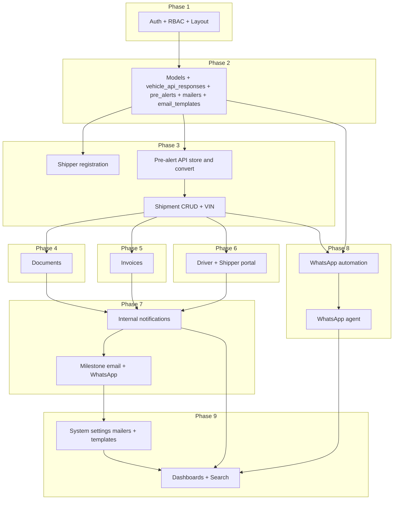

# ASLMS Implementation Plan

This plan builds the system per the updated [system_specification/](system_specification/), using the existing Laravel 12 app with Fortify, Livewire, and Flux. It reflects: **shipper registration**, **pre-alert with API response storage**, **WhatsApp automation first / agent on escalation**, **milestone communications** (email + WhatsApp to shippers with templates and multiple mailers), and **system settings** (mailers, email templates). **Web** allows manual override when the VIN API fails; **WhatsApp** pre-alert creation returns an error message only (no manual override).

---

## Architecture alignment

- **Layers:** Presentation (Livewire + Blade + Tailwind/Flux), Application (Controllers, Form Requests, Policies), Domain (Services), Data (Eloquent), Infrastructure (vehicle API, WhatsApp, storage). Controllers stay thin; business logic in Services ([02_Architecture.md](system_specification/02_Architecture.md)).
- **Auth:** Fortify; **roles** and **staff_type** for RBAC and Staff-type checks ([03_Roles_and_Permissions.md](system_specification/03_Roles_and_Permissions.md)).
- **Pre-alert:** VIN (and receipt for WhatsApp) → call vehicle API → **store full response** in `vehicle_api_responses` → create `pre_alert` linked to that response ([05_Database_Specification.md](system_specification/05_Database_Specification.md) §3.3–3.4).
- **WhatsApp:** **Automation first** (menu: get shipment info, create pre-alert, send documents); **agent only after escalation** ([09_WhatsApp.md](system_specification/09_WhatsApp.md)). WhatsApp pre-alert: if vehicle API fails, error message only; no manual override.
- **Milestone communications:** For each milestone, send **email** to shipper (templates + mailers e.g. booking@, account@) and **WhatsApp** when 24h session active ([04_Functional_Requirements.md](system_specification/04_Functional_Requirements.md) §8.2).

---

## Phase 1: Foundation (Auth, RBAC, Staff types, Layout)

**Goal:** Authenticated users with roles and staff types; shared layout and navigation; policies/middleware for role and staff type.

1. **Database: roles and users**
   - Migration: `roles` (super_admin, admin, staff, agent, driver, shipper). Migration: add `role_id`, `staff_type` (accountant, booking_manager, logistics_officer when role = staff) to `users`.
   - Model: `Role`; extend `User` with `role()`, `staffType()`, `hasRole()`, `hasStaffType()`.
2. **Authorization**
   - Middleware: `EnsureUserHasRole`. Policies: role + staff_type checks.
3. **Layout and navigation**
   - Main layout: top bar (logo, search placeholder, notification bell, user dropdown), role-based sidebar, main content. Dashboard per role (placeholders ok).
4. **Seed**
   - One user per role (including Staff types), one Shipper with linked shipper record.

**Deliverables:** Roles and staff_type; middleware and role-based layout; seeded users.

---

## Phase 2: Core data model and migrations

**Goal:** All MVP tables per [05_Database_Specification.md](system_specification/05_Database_Specification.md), including **vehicle_api_responses**, **pre_alerts**, **mailers**, **email_templates**; Eloquent models; no business logic yet.

1. **Migrations (order by FK)**
   - Roles, users (Phase 1).
   - **Shippers**, **consignees** (shipper_id).
   - **vehicle_api_responses** (id, vin, raw_response, requested_at) for storing API responses and avoiding duplicate paid calls.
   - **pre_alerts** (shipper_id, vin, vehicle_api_response_id, receipt_media_path, status, shipment_id after conversion, etc.).
   - Shipments, vehicle_photos, vehicle_sales_history; optional driver_assignments.
   - Documents; invoice_item_templates, invoices, invoice_lines.
   - conversations, messages; notifications, activity_logs.
   - **mailers** (name, from_address, from_name, smtp_*, is_active) for booking@, account@, etc.
   - **email_templates** (name, mailer_id, subject, body_html, is_active) per milestone.
   - Optional: **sent_communications** (channel, recipient, template, milestone, shipment_id, sent_at). Indexes per spec §10.
2. **Models**
   - Shipper, Consignee, VehicleApiResponse, PreAlert, Shipment, VehiclePhoto, VehicleSaleHistory, Document, InvoiceItemTemplate, Invoice, InvoiceLine, Conversation, Message, Notification, ActivityLog, Mailer, EmailTemplate. Relationships and soft deletes per spec.
3. **Factories and seeders**
   - Factories for Shipper, PreAlert, Shipment, Invoice, etc. Seed mailers and default email_templates for milestones.

**Deliverables:** Full schema including API response and email/mailer tables; models and relationships; seed data.

---

## Phase 3: Shipper registration, Pre-alert, and Shipment lifecycle

**Goal:** Register shippers from the system; pre-alert creation (web) with VIN → API → store response → create pre-alert; convert pre-alert to shipment; shipment create/edit; VIN lookup (web) and activity log.

1. **Shipper registration**
   - CRUD for shippers (Admin/Staff or self-registration per config). Once registered, shipper can create pre-alerts and use portal. Link shipper to user when portal access needed.
2. **Pre-alert flow (web)**
   - Form: at least VIN (and notes/reference). On submit: (1) Call vehicle-details API with VIN. (2) **Store full response** in `vehicle_api_responses`. (3) Create `pre_alert` (shipper_id, vin, vehicle_api_response_id, status = pending). Policy: Shipper (own) or Staff. List: Shipper sees own; Admin/Staff see all. Convert: Admin/Booking Manager creates Shipment from pre-alert using stored API data (no second API call); link pre_alert.shipment_id, mark converted.
3. **Shipment create/edit**
   - ShipmentService: create from pre-alert (use vehicle_api_responses) or blank; validate; reference_no; three status dimensions. Edit until locked; VIN uniqueness among non-deleted. Policies by role and staff_type.
4. **VIN lookup (web)**
   - Reuse: if vehicle_api_responses has entry for VIN, use it. Else call API, store in vehicle_api_responses, then use. **Web only:** when API fails, allow manual override. Populate vehicle fields and vehicle_photos from stored or new response.
5. **Activity log**
   - Log create/update/delete shipment, pre-alert convert; old_values/new_values for shipment status. Critical ops list per spec.

**Deliverables:** Shipper registration; pre-alert create with API store and convert; shipment create/edit; VIN reuse and activity log; shipment show page (placeholders for docs/invoice/timeline).

---

## Phase 4: Documents (Upload, Dock Receipt, Access)

**Goal:** Upload/replace documents; generate Dock Receipt PDF; current version only per type; signed URLs; access by role and staff type.

**Deliverables:** Document upload/replace; Dock Receipt generation; secure download; logging and notifications.

---

## Phase 5: Invoices (Templates, Lines, Clear, Void)

**Goal:** Invoice item templates (Admin); invoice create and lines (Admin/Accountant/Booking Manager); invoice number = shipment reference; clear (Admin/Accountant) and void (Admin); sync and immutable once cleared.

**Deliverables:** Invoice templates; invoice create and line management; clear/void with sync and audit.

---

## Phase 6: Driver assignment and Shipper portal

**Goal:** Driver assignment; driver UI (assigned jobs, confirm pickup/delivery, title docs); Shipper portal (own shipments, pre-alert, consignees, view/download docs and invoice).

**Deliverables:** Driver assignment and UI; Shipper portal; title docs and pickup confirmation.

---

## Phase 7: Internal notifications and Milestone communications

**Goal:** Internal (in-app) notifications for key events; dropdown, role-based, click to shipment, retention. **Plus:** for each **shipment milestone**, send **email** to shipper (template + appropriate mailer) and **WhatsApp** when 24h session active; optional sent_communications log.

1. **Internal notifications**
   - Create Notification on events (shipment created, driver assigned, document uploaded, invoice cleared, conversation escalated). Dropdown in layout; role-based; link to shipment; retention job (e.g. 30 days).
2. **Milestone communications to shipper**
   - Define milestones (e.g. pre_alert_received, shipment_created, driver_assigned, dock_receipt_ready, invoice_ready, invoice_cleared, shipment_completed). On each: load EmailTemplate and Mailer (booking@ for booking milestones, account@ for invoice/payment); send email to shipper; if WhatsApp conversation exists and session active, send WhatsApp message. Placeholders: shipper_name, reference_no, link_to_shipment, etc. Optional: log in sent_communications.
3. **Action history timeline**
   - Shipment show page: ActivityLog entries for shipment. Admin: full audit log view.

**Deliverables:** Internal notifications and dropdown; milestone emails and WhatsApp to shippers; timeline and audit log.

---

## Phase 8: WhatsApp (Automation first, Agent on escalation)

**Goal:** Webhook; **automation layer** (menu: get shipment info, create pre-alert, send documents); **agent layer** only after customer escalates; conversation and message storage; 24h session.

1. **Webhook and identity**
   - POST webhook: verify signature; parse payload; find/create Conversation by shipper phone (map phone to Shipper). Store Message. Update session_expires_at (24h).
2. **Automation handler (first layer)**
   - **Menu / intent:** e.g. Get shipment info, Create pre-alert, Talk to agent.
   - **Get shipment info:** User sends VIN or reference. Look up shipment for this shipper; reply with status; optionally send document (e.g. Dock Receipt) via WhatsApp Business API (sendDocument).
   - **Create pre-alert:** User sends VIN and receipt/bill of sale (image or document). Call vehicle API; if success: store response in vehicle_api_responses, create pre_alert (receipt_media_path), confirm to user via WhatsApp. **If API fails:** send error message to user via WhatsApp only; do not create pre-alert; no manual override.
   - **Talk to agent:** Set conversation status = escalated; do not assign to agent yet (assignment in step 3). Automation stops handling.
3. **Assignment and agent (second layer)**
   - Escalated conversations: assign to agent (e.g. round-robin if unassigned for X time). assigned_agent_id set; status = assigned. Agent UI: conversation list (escalated/assigned), chat panel, shipment linking, internal notes, send text/media; session reactivation when expired.
4. **Outbound and media**
   - Send text, template, document. 24h rule: if expired, only template until customer sends (reactivation). Media stored under storage/app/whatsapp.

**Deliverables:** Webhook; automation (get shipment info, create pre-alert, send documents); escalation and agent UI; conversation and message storage.

---

## Phase 9: System settings, Dashboards, Search, Admin

**Goal:** **System settings:** multiple mailers (Super Admin), email templates per milestone (Admin or Super Admin). Role dashboards; global shipment search; user management; audit log.

1. **System settings**
   - **Mailers:** Super Admin CRUD for mailers (name, from_address, smtp_*). Used for milestone emails (booking@, account@).
   - **Email templates:** Admin (or Super Admin) CRUD for email_templates (name, mailer_id, subject, body_html, placeholders). One per milestone.
2. **Global search**
   - Search by reference_no, VIN, shipper name, date, status. Pagination 25.
3. **Dashboards**
   - Admin/Staff: metrics, shipment table, filters. Agent: conversation counts. Driver/Shipper: as in Phase 6.
4. **User management**
   - Admin: CRUD users, role, staff_type, is_active. Super Admin: no access to operational data; only mailers and API keys (or env).
5. **Audit log**
   - Admin: list ActivityLog; filters; export if in scope.

**Deliverables:** Mailers and email templates UI; search; dashboards; user management; audit log.

---

## Phase 10: Polish, testing, deployment

**Goal:** Feature and policy tests; UI polish; queue workers; deployment checklist. Include tests for: shipper registration; pre-alert with API store; milestone email trigger; WhatsApp automation (mock), including WhatsApp pre-alert API failure → error message only (no manual override).

**Deliverables:** Tests; UI polish; queue and deployment.

---

## Dependency overview

---

## Suggested implementation order

| Phase | Focus                                                                                               | Depends on |
| ----- | --------------------------------------------------------------------------------------------------- | ---------- |
| 1     | Foundation (roles, staff_type, layout)                                                              | —          |
| 2     | Core data (incl. vehicle_api_responses, pre_alerts, mailers, email_templates)                        | 1          |
| 3     | Shipper registration; Pre-alert (API → store → create); Shipment lifecycle; VIN reuse; Activity log | 2          |
| 4     | Documents (upload, Dock Receipt, download)                                                           | 2, 3       |
| 5     | Invoices (templates, lines, clear, void)                                                            | 2, 3       |
| 6     | Driver assignment and Shipper portal                                                                | 3, 4       |
| 7     | Internal notifications and Milestone communications (email + WhatsApp to shippers)                 | 3, 4, 5, 6 |
| 8     | WhatsApp automation first (menu, get info, create pre-alert, send docs); agent on escalation        | 2, 3       |
| 9     | System settings (mailers, email templates); Dashboards; Search; Admin                               | 1–8        |
| 10    | Testing; polish; queue; deployment                                                                   | 1–9        |

This aligns the implementation plan with the updated spec (shipper registration, API response storage, WhatsApp automation-first with no manual override on pre-alert API failure, milestone emails and templates, system settings).
